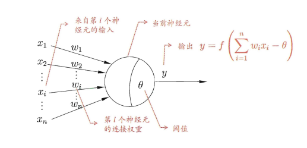

## 第五章 神经网络
**概述：本次组队学习主要完成了：**
&emsp;&emsp;**1.学习了神经网络的相关基础内容；**
&emsp;&emsp;**2.对相应的一些公式进行了推导。**
### 5.1 神经元模型
&emsp;&emsp;神经网络是由具有适应性的简单单元组成的广泛并行互连的网络。

    

<!--  -->
$$图5.1 MP神经元模型$$
&emsp;&emsp;**step1**.神经网络基本单元——**神经元（neuron）**
&emsp;&emsp;**step2**.**"M-P神经元模型**经元接收到来自n个其他神经元传递过来的输入信号，这些输入信号通过带权重的连接(connection) 进行传递，神经元接收到的总输入值将与神经元的阀值进行比较，然后通过"激活函数" (activation function 处理以产生神经元的输出.
&emsp;&emsp;**step3**.实际常用Sigmoid函数作为激活函数，典型的 Sigmoid 函数如下图所示，它把可能在较大范围内变化的输入值挤压到 (0,1) 输出值范围内，因此有时也称为 "挤压函数" (squashi function)
<!-- 

    

 -->

$$图5.2 Sigmoid-function函数$$
&emsp;&emsp;**step4**.把许多个这样的神经元按一定的层次结构连接起来，就得到了神经网络。
### 5.2 感知机与多层网络
&emsp;&emsp;感知机(Perceptron 由两层神经元组成，输入层接收外界输入信号后传递给输出层， 输出层是M-P 经元，亦称"阔值逻辑单元" (threshold logic unit).
&emsp;&emsp;1. 感知机只能解决线性可分的问题，对于非线性可分的问题需要用到多层功能神经元。
&emsp;&emsp;——》**多层功能神经元**
<!-- 

    

 -->

$$图5.2 多层神经网络模型$$
&emsp;&emsp;2.每层神经元与下层神经元全互连，神经元之间不存在同层连接，也不存在跨层连接 这样经网络结构通常称为"多层前馈神经网 (multi-layer feedforward neural networks)。
### 5.3 误差逆传播算法
&emsp;&emsp;1. 多层网络的学习能力比单层感知机强得多.欲训练多层网络，简单感知机学习规则显然不够了，需要更强大的学习算法.误差逆传播(error BackPropagation ，简称 BP) 算法就是其中最杰出的代表?它是迄今最成功的神经网络学习算法.
&emsp;&emsp;2. 通常说 "BP 网络"时，一般是指用 BP 算法训练的多层前馈神经网络
&emsp;&emsp;3. BP是一个法代学习算法，在迭代 采用 的感知机学规则对参数进行更新估计。
&emsp;&emsp;4. BP 算法基于梯度下降(gradient descent) 策略，以目标的负梯度方向对参数进行调整。
&emsp;&emsp;5. 下面是BP神经网络的几个常用结论的推导过程：

<!-- 

    

 -->

$$图5.3 三层神经网络各层函数关系图$$
<!-- 

    

 -->

$$图5.4 推导过程01$$
<!-- 

    

 -->

$$图5.5 推导过程02$$

##### 参考：周志华《机器学习》
