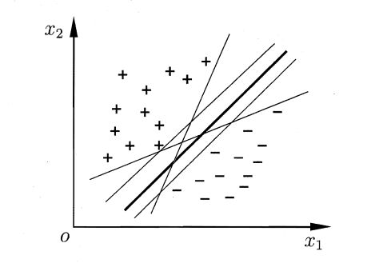
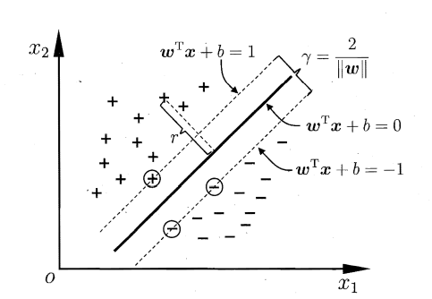
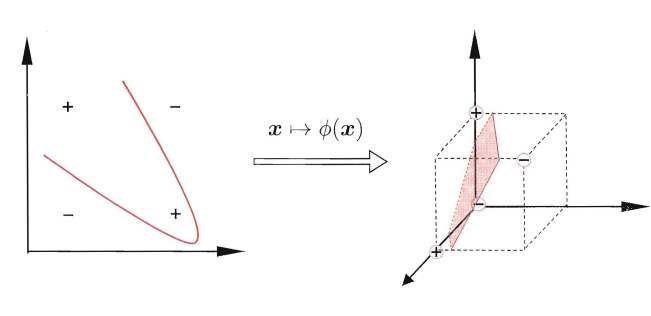
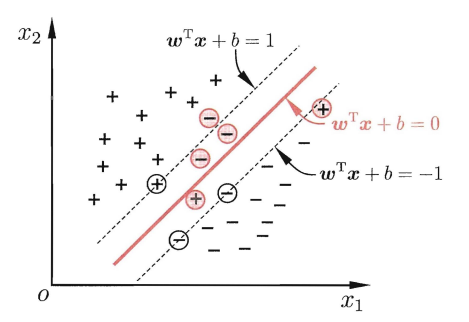
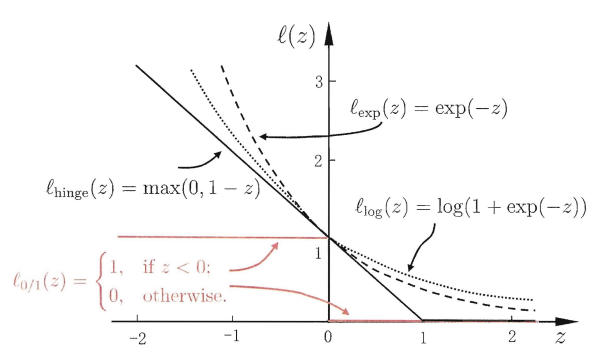
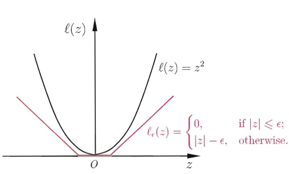
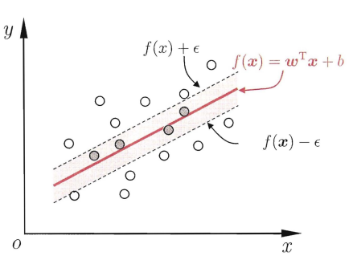

## 第六章 支持向量机
**目录：**
&emsp;&emsp;**1.学习了支持向量机的相关基础内容；**

### **6.1间隔与支持向量**

&emsp;&emsp;**???Question**：给定训练样本$D = {(X_1 , Y_1) (X_2,Y_2) , ... , (X_m, Y_m)} , Y_{i}为-1或者+1$，分类学习最基本的想法就是基于训练集D在样本空间中找到一个划分超平面,将不同类别的样本分开。

    

图6.1-存在多个划分超平面将两类训练样本分开

&emsp;&emsp;样本空间中任意点$x$到超平面$(w,b)$的距离可写为:
$$
\begin{align}
r = \frac{w^Tx+b}{||w||}
\end{align}
$$
&emsp;&emsp;假设超平面$(w,b)$能够将训练样本正确分类，即对于$(x_i,y_i)∈D，若y_i=+1,则有w^Tx_i+b>0;若y_i=-1,则w^Tx_i+b<0.令$
$$
\begin{align}
\begin{cases}
w^T + b ≥ +1,\quad  y_i=+1;\\
w^T + b ≤ -1,\quad  y_i=-1.
\end{cases}
\end{align}
$$
&emsp;&emsp;**>>>Answer**：距离超平面最近的这几个训练样本点使上面的式子的等号成立，它们被称为**支持向量**(support vector)。
&emsp;&emsp;两个异类支持向量到超平面的距离之和为：
$$
\begin{align}
γ = \frac{2}{||w||}
\end{align}
$$
该距离又称为**间隔**。

    

图6.2-支持向量与网络

&emsp;&emsp;现在的目标是找到具有**最大间隔** (maximum margin)的划分超平面，也就是要找到能满足式(2)中约束的参数$w和b使得γ$最大，即可转换成以下优化问题：
$$
\begin{align}
&\underset {w,b}{max}\quad \frac{2}{||w||}
\\
\quad
&s.t.\quad y_i(w^Tx_i+b)≥1,\quad i=1,2,...,m.
\end{align}
$$
上式又可等效于：
$$
\begin{align}
&\underset {w,b}{max}\quad \frac{1}{2}||w||^2
\\
&s.t.\quad y_i(w^Tx_i+b)≥1,\quad i=1,2,...,m.
\end{align}
$$

### 6.2 对偶问题
&emsp;&emsp;**???Question**：注意到上式是一个凸二次规划(convex
quadratic programming)问题。
&emsp;&emsp;**>>>Answer**：可以使用拉格朗日乘子法可得到其"对偶问题" (dual problem)，从它的‘对偶面’来求解问题有时候更加简单（正难则反。
$$
\begin{align}
L(w,b,a) = \frac{1}{2}||w||^2+\sum_{i=1}^m\alpha_i(1-y_i(w^Tx_i+b))
\end{align}
$$
经过计算，上述问题可以等效于求解下列优化问题：
$$
\begin{align}
&\underset {\alpha}{max}\quad \sum_{i=1}^{m}\alpha_i-\frac{1}{2}\sum_{i=1}^{m}\sum_{j=1}^{m}\alpha_i\alpha_iy_iy_jx_{i}^{T}x_j
\\
&s.t.\quad \sum_{i=1}^{m}\alpha_i
y_i=0,
\\
&\quad\quad\alpha_i\geq 1,\quad i=1,2,...,m.
\end{align}
$$
&emsp;&emsp;求解上述问题比较高效的求解算法是：**SMO(Sequential Minimal Optimization)**(求解步骤详情见：周志华《机器学习》)

### 6.3 核函数
&emsp;&emsp;引入核函数的目的：样本在低维度空间线性不可分，得益于数学家们的不懈努力，可以将数据映射到高维空间使得样本可分(打call)。

    

6.3-异或问题与非线性映射

&emsp;&emsp;**???Question**：在求解对偶问题存在这样的问题：此直接计算$φ(x_i)φ(x_j)$通常是困难的。
&emsp;&emsp;**>>>Answer**：现在存在一个这样的函数，使得
$$
κ(x_i,x_j) = <φ(x_i)φ(x_j)> = φ(x_i)φ(x_j)
$$
成立，而计算$κ(x_i,x_j)$是容易的。
&emsp;&emsp;κ(,)称为‘核函数’(kernel function)
&emsp;&emsp;**常用的核函数有：线性核、多项式核、高斯核、拉普拉斯核、Sigmoid核**。

### 6.4 软间隔与正则化
&emsp;&emsp;**???Question**：在前面的讨论中，我们一直假定训练样本在样本空间或特征空间中是线性可分的。即存在一个超 面能将不同类的样本完全划分开 ，然而现实是：往往很难确定合适的核函数使得训练样本在特征空间中线性可分。更糟糕的是：即使恰好找到了某个核函数使训练集在特征空间中线性可分，也很难确定这个貌似线性可分的结果不是由于过拟合所造。

    

6.4-软间隔示意图-红色圈出了一些不满足约束的样本

&emsp;&emsp;**>>>Answer**：缓解该问题的一个办法是允许支持向量机在一些样本上**故意**出错.为此要引入"软间隔" (soft margin)的概念。
&emsp;&emsp;软间隔直观上理解就是：部分样本在‘中间区域’，即不满足约束：
$$
\begin{align}
y_i(w^Tx_i+b)\geq 1
\end{align}
$$
在最大化间隔同时，不满足约束的样本应尽可能少，进一步优化目标可写为：
$$
\begin{align}
\underset {w,b}{min}\quad \frac{1}{2}||w||^2+C\sum_{i=1}^ml_{0/1}(y_i(w^Tx_i+b)-1)
\end{align}
$$
其中，C>0,是一个常数，l_(0/1)是‘0/1损失函数’
$$
\begin{align}
l_{0/1}(z)=\begin{cases}
1,\quad if z<0;\\
0,\quad otherwise
\end{cases}
\end{align}
$$
&emsp;&emsp;人们通常用其他一些函数来代替l_{0/1},称为"替代损失" (surrogate 10ss). 替代损失函数一般具有较好的数学性质。常用替代损失函数：
$$
\begin{align}
\begin{cases}
hinge损失：l_{hinge}(z)=max(0,1-z)\\
指数损失(exponential loss):l_{exp}(z)=exp(-z)\\
对率损失(logistic loss):l_{log}(z)=log(1+exp(-z))
\end{cases}
\end{align}
$$

    

6.5-三种常见的替代损失函数：hingo损失、指数损失、对率损失

&emsp;&emsp;可写为更一般的形式

$$
\begin{align}
\underset {f}{min} Ω(f)+C\sum_{i=1}^{m}l(f(x_i),y_i)
\end{align}
$$
其中$Ω(f)$称为‘结构风险’，描述模型f的某些性质；第二项$C\sum_{i=1}^{m}l(f(x_i),y_i)$称为‘经验风险’，描述模型与训练数据的契合程度。

### 6.5  支持向量回归
&emsp;&emsp;**???Question**：与传统回归模型（当模型输出f(x)和真实值y不相等时存在损失）不同，支持向量回归(Support Vector Regression，简称SVR)假设我们能容忍f(x)之间最多有ε的偏差，即仅当f(x)与y之间的差别绝对值大于时才计算损失。
&emsp;&emsp;**>>>Answer**：以f(x)为中心,构建了一个宽度为2ε的问隔带，若训练样本落入此间隔带，则认为是被预测正确的。

    

6.7-ε-不敏感损失函数

 &emsp;&emsp;于是，SVR 问题可形式化为
$$
\begin{align}
\underset {w,b}{min}\quad \frac{1}{2}||w||^2+C\sum_{i=1}^ml_{0/1}(f(x_i)-y_i))
\end{align}
$$
其中C为正则化常数，l_(0/1)是ε-不敏感损失函数
$$
\begin{align}
l_{0/1}(z)=\begin{cases}
1,\quad\quad\quad  &if |z|<ε;\\
|z|-ε,\quad &otherwise
\end{cases}
\end{align}
$$

    

6.6-支持向量回归示意图.红色显示出e间隔等，落入其中的样本不计算损失

&emsp;&emsp;引入松弛变量$ξ_i和\widehat{ξ}_i$，进而再引入拉格朗日乘子$μ_i\geq0,\widehat{μ}_i\geq0,\alpha_i\geq0,\widehat{\alpha}_i\geq0,$得到朗格朗日函数：
$$
\begin{equation}
\begin{aligned}
&L(\pmb{w,b,\alpha,\widehat{\alpha},\xi,\widehat{\xi},\mu,\widehat{\mu}})\\
&=\frac{1}{2}||w||^2+C\sum_{i=1}^{m}(\xi_i+\widehat{\xi}_i)-\sum_{i=1}^{m}\mu_i\xi_i-\sum_{i=1}^{m}\widehat{\mu}_i\widehat{\xi}_i\\
&+\sum_{i=1}^{m}\alpha_i(f(x_i)-y_i-\epsilon-\xi_i)+\sum_{i=1}^{m}\widehat{\alpha}_i(y_i-f(x_i)-\epsilon-\widehat{\xi}_i)
\end{aligned}
\end{equation}
$$
求偏导等于0，代入上式可得到SVR的对偶问题：
$$
\begin{equation}
\begin{aligned}
\underset{\alpha,\widehat{\alpha}}{max}\quad&\sum_{i=1}^{m}y_i(\widehat{\alpha}_i-\alpha_i)-\epsilon(\widehat{\alpha}_i+\alpha_i)\\
&-\frac{1}{2}\sum_{i=1}^{m}\sum_{j=1}^{m}(\widehat{\alpha}_i-\alpha_i)(\widehat{\alpha}_j-\alpha_j)x_i^Tx_j
\end{aligned}
\end{equation}
$$
$$
\begin{equation}
\begin{aligned}
s.t.\quad&\sum_{i=1}^{m}(\widehat{\alpha}_i-\alpha_i)=0,\\
&0\leq\alpha_i,\widehat{\alpha}_i\leq{C}
\end{aligned}
\end{equation}
$$
上述过程中需满足**KKT**条件，即要求:
$$
\begin{align}
\begin{cases}
\alpha_i(f(x_i)-y_i-\epsilon-\xi_i)=0,\\
\widehat{\alpha}_i(y_i-f(x_i)-\epsilon-\widehat{\xi}_i)=0,\\
\alpha_i\widehat{\alpha}_i=0,\xi_i\widehat{\xi}_i=0,\\
(C-\alpha_i)\xi_i=0,(C-\widehat{\alpha}_i)\widehat{\xi}_i
=0
\end{cases}
\end{align}
$$
&emsp;&emsp;求解上式即可得到SVM模型的解。
 &emsp;&emsp;以上就是学习SVM模型基础知识的简记，有关详细内容请参考资料：周志华《机器学习-第6章 支持向量机》
